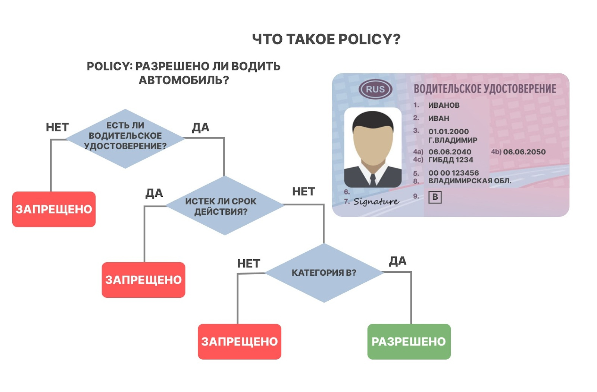

# Понимание роли политик в разработке

В разработке программного обеспечения, политики (policy) играют важную роль, определяя правила и ограничения, которые управляют поведением системы или приложения. Эти политики определяются на основе требований бизнеса, правовых норм, стандартов безопасности и других факторов, и предназначены для обеспечения безопасности, конфиденциальности и соответствия в рамках разработанного программного продукта.

## Роль политик в процессе разработки

Политики выполняют несколько важных функций в процессе разработки:

1. **Определение правил доступа:**
    - Политики устанавливают правила доступа к ресурсам и функциям приложения. Это включает в себя определение, кто и в каких случаях имеет право на доступ к определенным данным или возможностям в приложении.

2. **Контроль безопасности:**
    - Политики безопасности определяют правила и меры безопасности, необходимые для защиты приложения от угроз и атак. Это может включать установку требований к паролям, контроль доступа к административным функциям, а также мониторинг и регистрацию действий пользователей.

3. **Соблюдение стандартов и регулирований:**
    - Политики также направлены на обеспечение соответствия приложения различным стандартам и регуляторным требованиям, таким как GDPR, HIPAA, PCI DSS и другим. Они определяют правила обработки персональных данных, хранения финансовой информации и другие аспекты, необходимые для соблюдения нормативных требований.

4. **Управление рисками:**
    - Политики помогают управлять рисками, связанными с использованием приложения, путем установки ограничений и контроля за различными аспектами его функционирования. Это может включать установку правил обработки конфиденциальной информации, ограничение доступа к опасным функциям и другие меры.

## Пример использования политик в разработке

Рассмотрим пример использования политик в разработке веб-приложения:

Предположим, что мы разрабатываем веб-приложение для онлайн-банкинга. В этом случае политики могут включать в себя следующее:

- **Политика доступа к данным:**
    - Определение правил доступа к финансовым данным, например, требование аутентификации пользователя и его авторизации для просмотра баланса или совершения транзакций.

- **Политика безопасности паролей:**
    - Установка требований к паролям пользователей, например, минимальная длина пароля, использование различных символов и периодическая смена пароля.

- **Политика мониторинга активности:**
    - Ведение журналов действий пользователей для обнаружения подозрительной активности, такой как несколько неудачных попыток входа или доступ к чувствительным данным из необычных мест.

## Зачем политики?

Использование политик в процессе разработки позволяет создавать безопасные, соответствующие требованиям приложения с минимальными рисками и обеспечивать его работу в соответствии с законодательством и стандартами отрасли.

---

# [Далее: Роли](role.md)