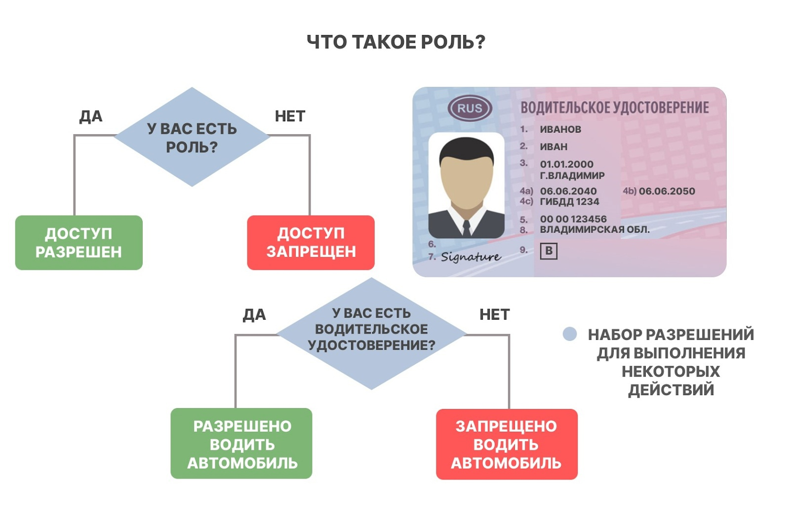

# Ролевая авторизация: Обеспечение безопасности вашего веб-приложения

В мире веб-разработки представьте, что вы организуете команду для школьного проекта. У каждого участника команды есть определенная роль и обязанности. Ролевая авторизация (Role-Based Authorization, RBA) работает аналогично в веб-приложениях, гарантируя, что пользователи имеют правильный доступ к ресурсам в зависимости от своих ролей. Давайте подробнее рассмотрим Ролевую авторизацию, используя простую аналогию и примеры, чтобы сделать ее понятной.

## Понимание Ролевой авторизации

### Что такое Ролевая авторизация?

Ролевая авторизация (RBA) похожа на назначение ролей в команде для школьного проекта. Каждая роль имеет определенные задачи и обязанности. Аналогично, в веб-приложении пользователям назначаются роли (например, "администратор" или "пользователь"), определяющие, что они могут и не могут делать в приложении.

### Зачем нужна Ролевая авторизация?

Представьте, что каждый участник вашей команды для школьного проекта мог делать все, независимо от их навыков или обязанностей. Хаос, верно? Ролевая авторизация предотвращает такой хаос в веб-приложениях, гарантируя, что пользователи имеют доступ только к ресурсам и функциям, соответствующим их ролям. Это повышает безопасность и организацию в приложении.

## Основные компоненты Ролевой авторизации

### Роли

Роли в Ролевой авторизации похожи на позиции в команде. Например, у вас может быть роль "Менеджера проекта", "Создателя контента" и "Рецензента". Каждая роль имеет определенные задачи и обязанности.

### Разрешения

Разрешения определяют, какие действия могут выполнять пользователи с определенной ролью. Например, роль "Менеджера проекта" может иметь разрешение на создание новых задач и их назначение участникам команды, в то время как роль "Рецензента" может иметь разрешение только на предоставление обратной связи по завершенным задачам.

## Реализация Ролевой авторизации

### Назначение ролей

Точно так же, как назначение ролей участникам команды для школьного проекта, пользователям в веб-приложении назначаются роли в соответствии с их обязанностями. Например, администратор веб-сайта может иметь роль "Администратор", в то время как обычные пользователи - роль "Пользователь".

### Управление разрешениями

Разрешения похожи на задачи, назначенные каждому участнику команды в школьном проекте. Вы определяете, что может делать каждая роль в веб-приложении. Например, только пользователям с ролью "Администратор" может быть разрешено удалять учетные записи пользователей, в то время как пользователи с ролью "Пользователь" могут только редактировать свою собственную информацию профиля.

## Пример из реальной жизни: Ролевая авторизация в интернет-магазине

Представьте, что вы владеете интернет-магазином. Вот как может работать Ролевая авторизация:

- **Роль Администратора:**
    - Эта роль имеет разрешение на управление продуктами, обновление цен и обработку заказов.

- **Роль Обслуживания клиентов:**
    - Пользователи с этой ролью могут помогать клиентам с запросами, управлять возвратами и обрабатывать обратную связь от клиентов.

- **Роль Клиента:**
    - Посетители веб-сайта имеют эту роль. Они могут просматривать продукты, добавлять товары в корзину и совершать покупки.

## Пример использования ролей в разработке

Предположим, что мы разрабатываем систему управления контентом (CMS). В этом случае роли могут включать:

- **Администратор:**
    - Имеет полный доступ к административным функциям системы, включая управление пользователями, контентом и настройками.

- **Редактор:**
    - Может создавать, редактировать и удалять контент на сайте, но не имеет права доступа к административным настройкам.

- **Пользователь:**
    - Может только просматривать контент на сайте, но не имеет права на его изменение или управление.

## Место ролей в разработке

Роли являются важным инструментом управления доступом и безопасностью в разработке программного обеспечения. Их правильное определение и применение позволяет создавать безопасные и функциональные приложения, соответствующие требованиям пользователей и бизнеса.

## Заключение

Ролевая авторизация похожа на назначение ролей и обязанностей в команде для школьного проекта. Реализуя Ролевую авторизацию в веб-приложениях, вы гарантируете, что пользователи имеют соответствующий уровень доступа к ресурсам в зависимости от их ролей. Это повышает безопасность, организацию и эффективность в приложении.

## [К оглавлению](../references.md)