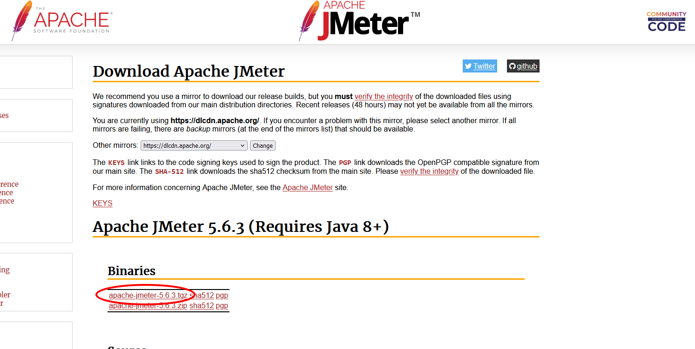
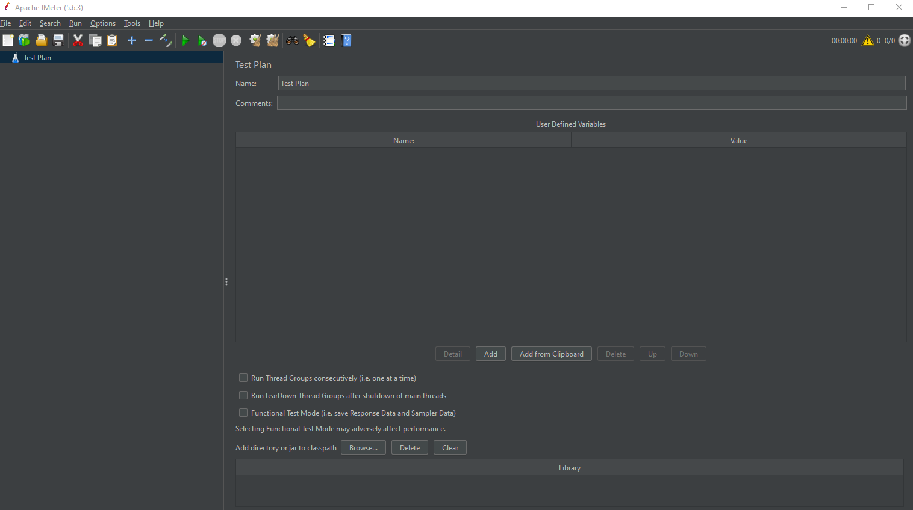

# Настройка JMeter

Для начала работы с JMeter вам потребуется установить его на вашем компьютере. Для этого перейдите
на [официальный сайт JMeter](https://jmeter.apache.org/) и загрузите последнюю версию JMeter для вашей операционной
системы.

Для этого перейдите в раздел релизов 

И скачайте tgz файл 

После загрузки архива распакуйте его в удобное для вас место на диске.

Теперь вы можете запустить JMeter, запустив файл `jmeter.bat` (Windows) или `jmeter.sh` (Linux/Mac) из папки bin.

После запуска вы увидите главное окно JMeter, где вы можете создавать и редактировать тестовые планы для вашего приложения.



Теперь вы готовы начать создавать тестовые сценарии и измерять производительность вашего приложения с помощью JMeter.

Также, для автоматического тестирования с помощью JMeter прямо внутри IDE (надеюсь это IntelliJ IDEA) можно использовать
плагин. Подключить его к проекту можно через Maven или Gradle просто добавив плагин в файл `pom.xml` или
`build.gradle` соответственно.

Для Maven:

```xml

<plugin>
    <groupId>com.lazerycode.jmeter</groupId>
    <artifactId>jmeter-maven-plugin</artifactId>
    <version>3.7.0</version>
    <executions>
        <execution>
            <id>jmeter-tests</id>
            <goals>
                <goal>jmeter</goal>
            </goals>
        </execution>
    </executions>
    <configuration>
        <testFilesDirectory>${project.basedir}/src/main/resources</testFilesDirectory>
        <resultsDirectory>${project.basedir}/src/main/resources</resultsDirectory>
    </configuration>
</plugin>
```

Для Gradle:

```groovy
plugins {
    id 'com.lazerycode.jmeter' version '3.7.0'
}

jmeter {
    testFilesDirectory = file("${projectDir}/src/test/jmeter")
    resultsDirectory = file("${projectDir}/build/jmeter-results")
}
```

Теперь вы можете запустить тесты просто выполнив команду `mvn verify` или `gradle jmeterRun`. Результаты тестирования
будут
доступны в папке `jmeter-results` (как указано в настройках, которые мы только что описали).

Также, для удобства, можно добавить плагин JMeter в IntelliJ IDEA. Для этого перейдите в
раздел `File -> Settings -> Plugins`
и найдите плагин `JMeter` в репозитории плагинов. Установите его и перезапустите IDE. Теперь вы сможете создавать и
редактировать тестовые планы прямо внутри IntelliJ IDEA (поддерживается только Community Edition IDE, в Ultimate Edition
плагин уже встроен в IDE и не требует установки - просто активируйте его в настройках IDE в
разделе `File -> Settings -> Plugins` в разделе `Installed` и перезапустите IDE)

# [**Следующий урок**: *Создание тестового плана*](test-plan.md)