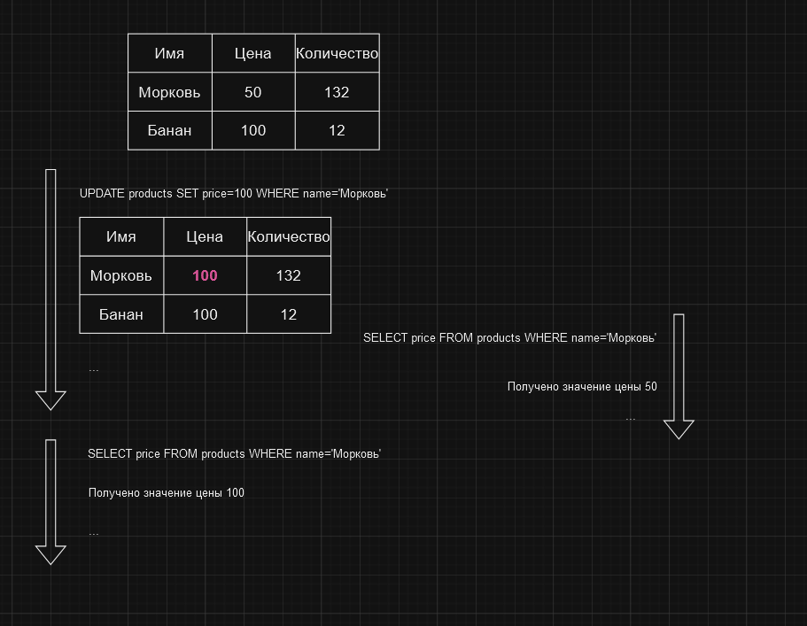

# Уровень изоляции транзакций READ COMMITTED

Транзакции видят только те изменения, которые были зафиксированы другими транзакциями. Этот уровень гарантирует 
исполнение принципа `согласованности` и является наиболее распространенным уровнем изоляции из-за
хорошего баланса между производительностью и надежностью. Суть его заключается в том, что транзакции видят только
те изменения, которые были зафиксированы другими транзакциями, но не видят изменения, которые еще не были зафиксированы.

Представим, что у нас есть база данных товаров магазина. Среди других, в ней есть таблица `products`, которая содержит
информацию о товарах. Предположим, что у нас есть две транзакции. Одна из них начинается и читает цену товара,
а другая начинается вместе с ней и изменяет эту цену. При использовании уровня изоляции READ COMMITTED, первая транзакция
может прочитать цену товара и получит старое значение, а затем вторая транзакция изменить эту цену. После этого первая 
транзакция сможет прочитать цену товара еще раз и получит уже измененное значение.

Как видим в примере, первая транзакция читает значение и вычисляет сумму, затем вторая транзакция изменяет значение и
фиксирует изменения. После этого первая транзакция читает значение еще раз и получает уже измененное значение, как
следствие получает сумму, отличающуюся от предыдущей.

Таким образом, уровень изоляции READ COMMITTED гарантирует исполнение принципа `согласованности` и является наиболее
распространенным уровнем изоляции.

Однако, ошибки вроде
[неповторяемого чтения](../problems/non-repeatable-reads.md)
или [фантомного чтения](../problems/phantom-reads.md)
все еще могут возникнуть, так данные с которыми работает транзакция открыты для изменений другими транзакциями.

# [**Назад**: *Уровни изоляции транзакций*](../principles/isolation.md)