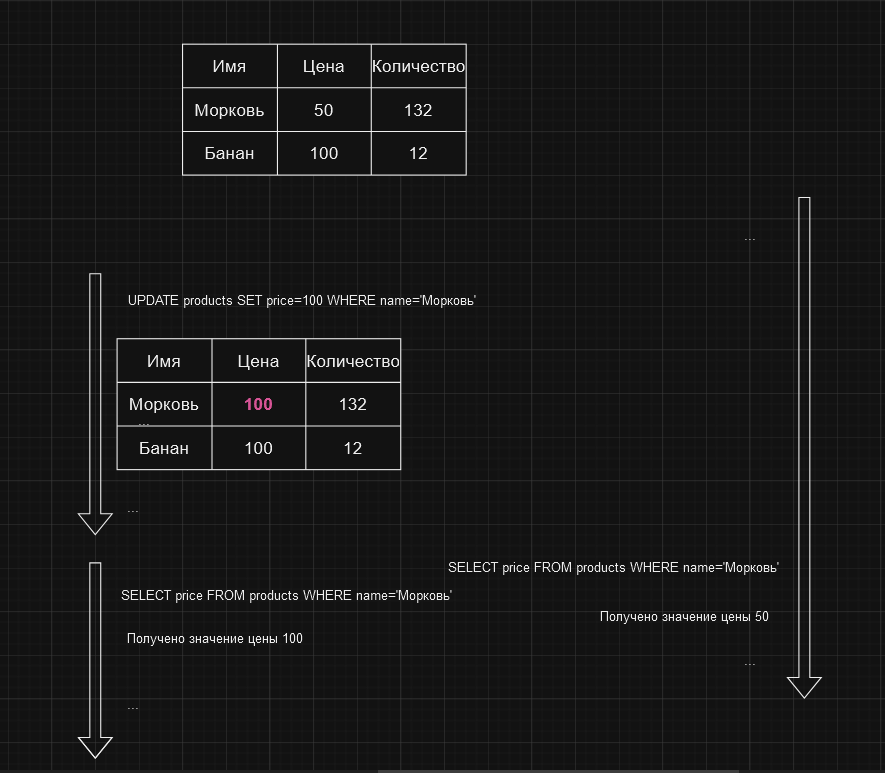

# Уровень изоляции REPEATABLE READ

Транзакции видят только те данные, которые были зафиксированы на момент начала транзакции. Этот уровень гарантирует
исполнение принципов `согласованности` и `изоляции`. Транзакции, исполняющиеся на уровне изоляции REPEATABLE READ,
не видят изменения, внесенные другими транзакциями после их начала. По сути транзакция сохраняет снимок данных на момент
начала ее исполнения и видит только этот снимок во время своего исполнения. Если же в процессе исполнения транзакции
другая транзакция изменяет данные, то первая транзакция не увидит эти изменения.

Представим, что у нас есть база данных товаров магазина. Среди других, в ней есть таблица `products`, которая содержит
информацию о товарах. Предположим, что у нас есть две транзакции. Одна из них начинается и читает цену товара,
а другая начинается и изменяет эту цену. При использовании уровня изоляции REPEATABLE READ, вторая транзакция изменит
значение или не изменит его, это не имеет значение. Первая транзакция может прочитать цену товара и получит старое 
значение, так как для нее база данных не менялась. Изменения будут видны первой транзакции только если вторая транзакция
завершилась раньше начала первой и первая успела прочитать измененную версию данных.

# TODO пояснение

Таким образом, уровень изоляции REPEATABLE READ гарантирует исполнение принципов `согласованности` и `изоляции` и является
одним из наиболее распространенных уровней изоляции. Однако, ошибки вроде
[фантомного чтения](../problems/phantom-reads.md) все еще могут возникнуть, так как данные с которыми работает транзакция
открыты для изменений другими транзакциями.

# [**Назад**: *Уровни изоляции транзакций*](../principles/isolation.md)

